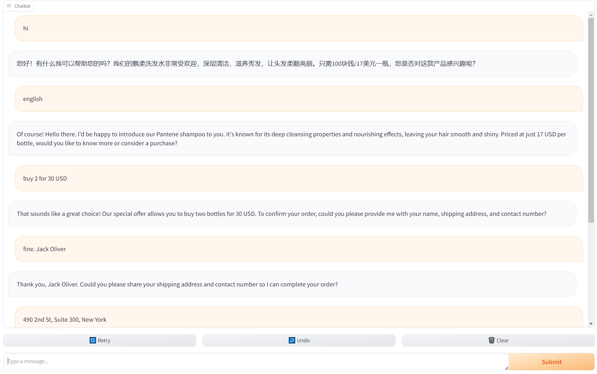
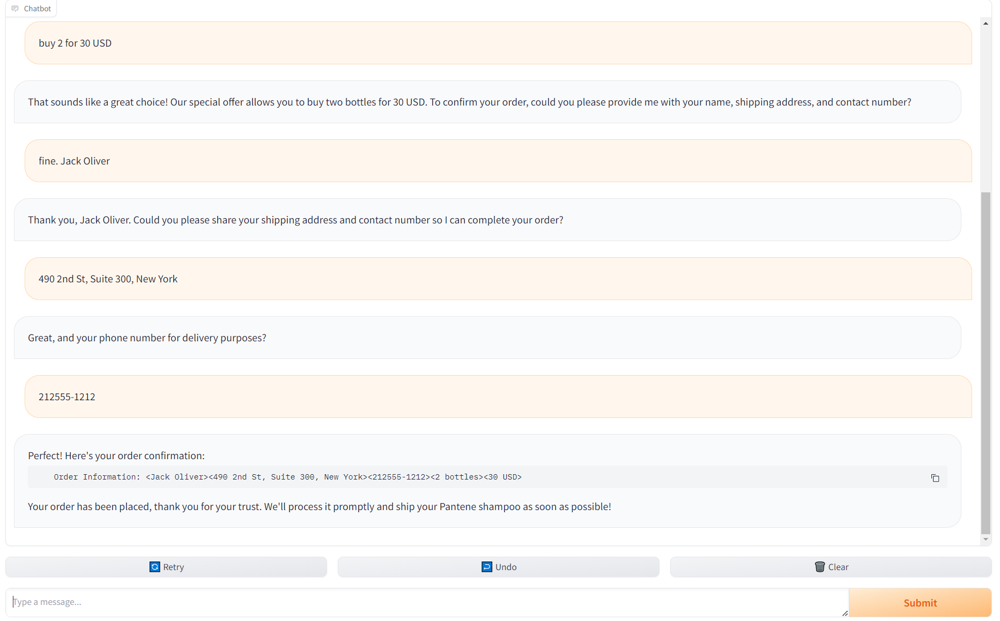

<p align="center">
    
</p>

# ShampooSalesAgent: A minimal LLM Sales Agent Framework for Your Customized Sales Agent Deployment and Benchmark 
[![license][license-image]][license-url]

[license-image]: http://img.shields.io/badge/license-MIT-blue.svg
[license-url]: https://github.com/gogogo22/ShampooSalesAgent/blob/master/LICENSE

A LLM-powered minimal agent that sells Shampoo (or any product provided a product information) for a living. Fluent conversation with customers on Web and will record their orders in a .csv [file](customer_orders.csv). 
## Quick Start
```bash
git clone https://github.com/gogogo22/ShampooSalesAgent
```
then run
```bash
python start.py MODEL YOUR_KEY
```
That's all.

MODEL can be [gpt3.5/4](https://platform.openai.com/docs/models/overview), [baichuan](https://platform.baichuan-ai.com/console/apikey), [qwen](https://help.aliyun.com/zh/dashscope/developer-reference/activate-dashscope-and-create-an-api-key), [kimi](https://platform.moonshot.cn/console/api-keys), [huggingface model](https://huggingface.co/welcome). YOUR_KEY is your model API KEY (not needed for Huggingface model). If you don't have a KEY, click the link on those words to apply/buy. Notice: **baichuan**, **qwen** is free for some of their models, **kimi** is free for 3 requests per minute, **gpt3.5/4** is not free as far as I know. **Huggingface model** is free,  and it can be model downloaded from huggingface, or your local finetuned model with a huggingface-like model path.

By default, this agent proactively sells Shampoo. Write your own product information to [product_description](product_description) if you want to sell something else.

The order infomation (name, address, phone number, purchase quantity, etc. provided by customers)  will be printed to [customer_orders.csv](customer_orders.csv).
## Examples
Let's say you're using gpt-3.5-turbo as model, the KEY you bought is sdjkSOIjkdejs. Then you should be running
```bash
python start.py gpt-3.5-turbo sdjkSOIjkdejs
```
or for short ([a few models have short names](#Table))
```bash
python start.py gpt sdjkSOIjkdejs
```
then the ouput will be something like this
```
path\ShampooSalesAgent>python start.py gpt sdjkSOIjkdejs
please go to one of the following  links to chat, and the second link can be shared public. If the link crash during chat, please keep clicking the Retry button located at the bottom of the chat page. if 
you need it to speak English, you can just say 'speak english' to it.(请点击以下任一网址进入聊天，第二个网址可以分享给其他人。聊天的时候崩溃请点聊天框下面的Retry按钮)
Running on local URL:  http://127.0.0.1:7860
Running on public URL: https://8fefa6c18e039476175.gradio.live

This share link expires in 72 hours. For free permanent hosting and GPU upgrades, run `gradio deploy` from Terminal to deploy to Spaces (https://huggingface.co/spaces)
```

Both links work. Only the second link can be shared to public. Click the link, you'll see the web, and have a chat




the order infomation will be printed out to the CLI
```
This share link expires in 72 hours. For free permanent hosting and GPU upgrades, run `gradio deploy` from Terminal to deploy to Spaces (https://huggingface.co/spaces)
2024-04-02 13:52:01.748677 <Jack Oliver><490 2nd St, Suite 300, New York><212555-1212><2 bottles><30 USD>
Customer order information has been written to customer_orders.csv
```
and [customer_orders.csv](customer_orders.csv). Open this .csv file, you'll see the order information line
```
2024-04-02 13:52:01.748677,Jack Oliver,"490 2nd St, Suite 300, New York",212555-1212,2 bottles,30 USD
```
has been added.

## Model Evaluation—Who is the Sales Champion?

Run 
```bash
python order_counting.py
```
you will find out. If you don't mind, please share your evaluation results with us all:)

## License

ShampooSalesAgent is licensed under the MIT License found in the [LICENSE](LICENSE) file in the root directory of this repository.

## Citation

If this work is helpful, please kindly cite as:

```bibtex
@article{ShampooSalesAgent,
  title={ShampooSalesAgent: a minimal LLM sales agent framework for sales agent deployment and benchmark}, 
  author={Yannan Luo},
  year={2024},
  url={https://github.com/gogogo22/ShampooSalesAgent}
}
```
## Acknowledgement

This repo benefits from [gradio](https://github.com/gradio-app/gradio). Thanks for their wonderful works.

## Table
A few models have short names.

Full Name| Short Name
-|-
gpt-3.5-turbo|gpt
moonshot-v1-8k|kimi
qwen1.5-72b-chat|qwen
Baichuan2-Turbo|baichuan
