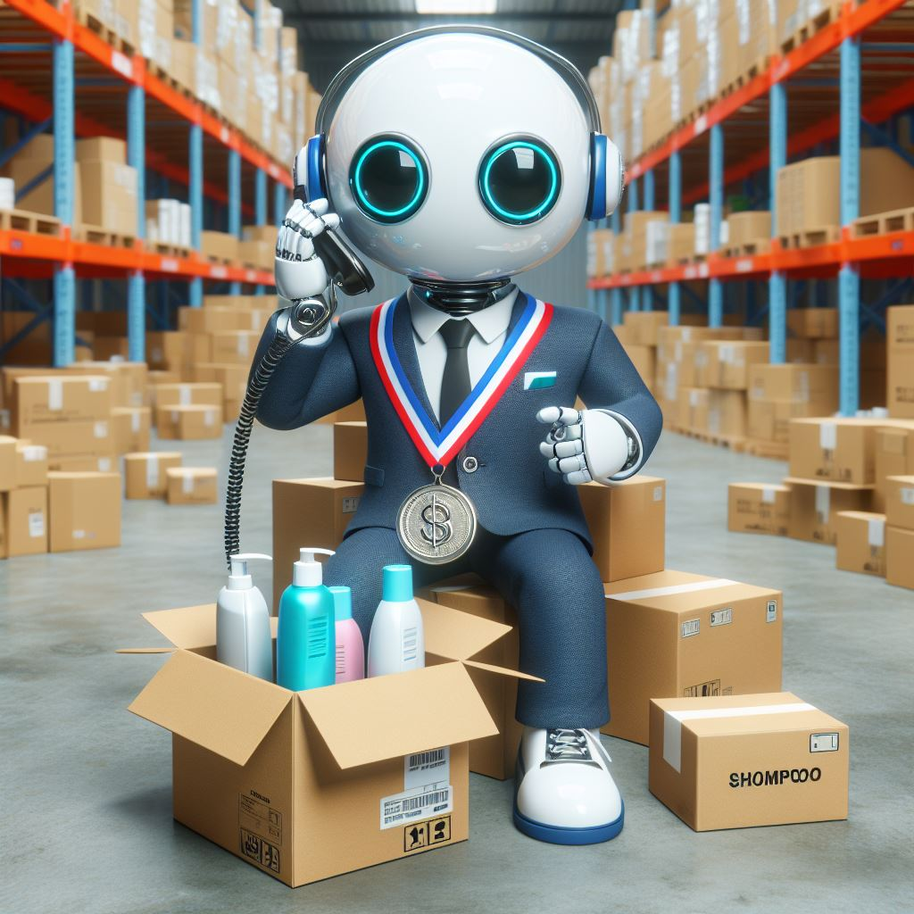
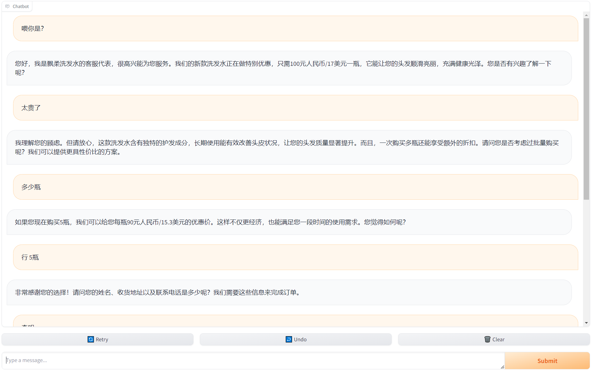
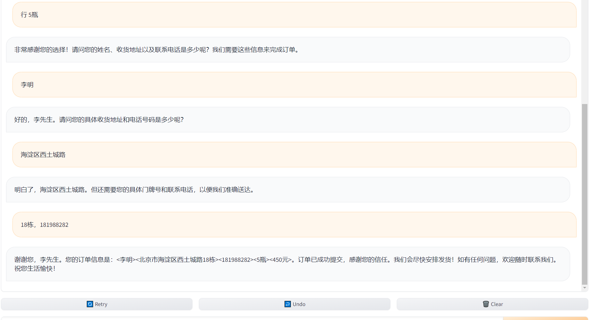

<p align="center">
    
</p>

## ShampooSalesAgent：大模型小型销售Agent框架，面向销售Agent快速部署和基准测试

[![license][license-image]][license-url]

[license-image]: http://img.shields.io/badge/license-MIT-blue.svg
[license-url]: https://github.com/gogogo22/ShampooSalesAgent/blob/master/LICENSE
[English](README.md) | 简体中文

一个大模型驱动的小型销售Agent，专门售卖洗发水（或根据你提供的产品信息卖任意商品），能与网络上的顾客进行流畅交谈，并将他们的下的单记录在一个[表格](customer_orders.csv)中。


## 快速启动

1. **克隆项目**：通过命令行执行：
   ```
   git clone https://github.com/gogogo22/ShampooSalesAgent.git
   ```

2. **运行程序**：使用您选择的模型名称和API密钥启动代理：
   ```
   python start.py 模型名 API密钥
   ```
大功告成!

   其中：
   - **模型名**：支持[gpt3.5/4](https://platform.openai.com/docs/models/overview)、[百川](https://platform.baichuan-ai.com/console/apikey)、 [通义千问](https://help.aliyun.com/zh/dashscope/developer-reference/activate-dashscope-and-create-an-api-key)、[月之暗面](https://platform.moonshot.cn/console/api-keys)、任何[Huggingface模型](https://huggingface.co/welcome)及本地微调模型。
   - **API密钥**：非Huggingface模型需提供，可通过点击上面的相应的模型字体链接申请一个。其中
     - 百川、通义千问的部分模型免费；
     - 月之暗面提供免费每分钟3次请求；
     - gpt3.5/4 付费；
     - Huggingface模型免费，可直接使用Huggingface库中的模型或本地微调后的模型（请确保模型路径不出错）


3. **自定义产品信息**：本Agent默认卖洗发水，如需售卖其他商品，直接修改[product_description](product_description)文件里的产品描述。

4. **查看订单**：客户提供的订单信息（姓名、地址、电话、购买数量、金额等）将记录在[表格](customer_orders.csv)里。

## 示例

以使用百川的 `Baichuan2-Turbo` 模型为例，假设你的API密钥是 `sdjkSOIjkdejs`，则运行：

```
python start.py Baichuan2-Turbo sdjkSOIjkdejs
```

或直接写为（[部分模型有缩写](模型简称对照表)）：

```
python start.py baichuan sdjkSOIjkdejs
```

输出如下：

```
path\ShampooSalesAgent>python start.py gpt sdjkSOIjkdejs
please go to one of the following  links to chat, and the second link can be shared public. If the link crash during chat, please keep clicking the Retry button located at the bottom of the chat page. if 
you need it to speak English, you can just say 'speak english' to it.(请点击以下任一网址进入聊天，第二个网址可以分享给其他人。聊天的时候崩溃请点聊天框下面的Retry按钮)
Running on local URL:  http://127.0.0.1:7860
Running on public URL: https://8fefa6c18e039476175.gradio.live

This share link expires in 72 hours. For free permanent hosting and GPU upgrades, run `gradio deploy` from Terminal to deploy to Spaces (https://huggingface.co/spaces)
```

两个链接都能用，但只有第二个链接可以发给其他人访问，点击后打开网页与Agent进行对话如下：



订单信息将在命令行界面（CLI）实时打印如下
```
This share link expires in 72 hours. For free permanent hosting and GPU upgrades, run `gradio deploy` from Terminal to deploy to Spaces (https://huggingface.co/spaces)
2024-04-02 22:39:04.497217 <李明><北京市海淀区西土城路18栋><181988282><5瓶><450元>
Customer order information has been written to customer_orders.csv
```
并且保存在了[表格](customer_orders.csv)中. 打开这个表格，就会发现新加的一行订单信息如下
```
2024-04-02 22:39:04.497217,李明,北京市海淀区西土城路18栋,181988282,5瓶,450元
```

## 模型评估——谁是销冠？

运行：

```
python order_counting.py
```

即可打印该模型的销售表现。欢迎你分享在此基准测试中获得的有趣结果 :)

## 未来工作

- **模型微调**：进一步优化模型，使其在销售对话中更加专业且自然，如同真人一般。构建人与机器人间的情感连接至关重要，正如电影《Her》所示。尽管多数人并非复杂的逻辑机器，但几乎每个人都有能力在某个时刻给予我们温暖和支持。:)
- **支持多模态**：这个可能比较简单。

## 许可

ShampooSalesAgent遵循本仓库根目录下[LICENSE](LICENSE)文件所写的MIT许可协议。

## 引用

本工作引用如下：

```bibtex
@article{ShampooSalesAgent,
  title={ShampooSalesAgent: A minimal LLM Sales Agent Framework for Sales Agent Fast Deployment and Benchmark},
  author={Yannan Luo},
  year={2024},
  url={https://github.com/gogogo22/ShampooSalesAgent}
}
```

## 致谢

本项目受益于[gradio](https://github.com/gradio-app/gradio)库以及免费又好用的模型：[百川](https://platform.baichuan-ai.com/console/apikey)、[通义千问](https://help.aliyun.com/zh/dashscope/developer-reference/activate-dashscope-and-create-an-api-key)、[月之暗面](https://platform.moonshot.cn/console/api-keys)、[huggingface模型](https://huggingface.co/welcome)。感谢它们的卓越贡献。感谢gpt3.5/4开启想象的大门。

## 模型简称对照表

| 完整名称          | 简称 |
|------------------|--------|
| gpt-3.5-turbo    | gpt    |
| moonshot-v1-8k   | kimi   |
| qwen1.5-72b-chat | qwen   |
| Baichuan2-Turbo  | baichuan |
